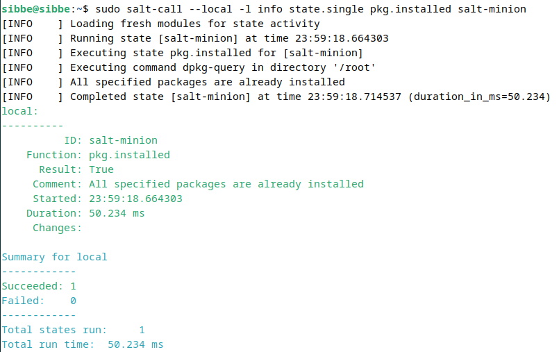

# h1 Viisikko

## X) Tiivistelmä: Verkkosivu Githubilla

1. Rekisteröidy Githubiin
2. Luo uusi säiliö, muista README.md tiedosto
3. Tallenna tehtävät .md tiedostoina
4. Lisää sisältö
5. Tarkista ja julkaise
(Tero Karvinen. 2023. https://terokarvinen.com/2023/create-a-web-page-using-github/)

## Tiivistelmä: Salt-komennot paikallisesti
1. Asennuskomennot
2. pkg.installed/removed tarkistaa ohjelman asennuksen/poiston
3. file.managed/absent tarkistaa onko tiedostoa
4. service.running/dead tarkistaa ajaako ohjelma
5. user.present/absent tarkistaa käyttäjän
6. cmd.run ajetaan ohjelma, indepotentti! (vain kun tarvitaan muutoksia)
(Tero Karvinen. 2023. https://terokarvinen.com/2021/salt-run-command-locally/)

## a) Salt-minionin asennus koneelle

Käytän Debian 12-virtuaalikonetta.  
Ennen Salt-minionin asennusta tein "Install Guest Additions for Good Resolution" jotta copypaste toimii.  
(Tero Karvinen. 2023. https://terokarvinen.com/2021/install-debian-on-virtualbox/)  
Tämän jälkeen suoritin asennusprosessin "Saltin asennus Debian 12" ohjeiden mukaisesti.  
(Tero Karvinen. 2023. https://terokarvinen.com/2023/configuration-management-2023-autumn/#h0-hello)  

## b) Viisi tärkeintä

Ohjeet tehtävään, joiden avulla tehtävä suoritettu: https://terokarvinen.com/2021/salt-run-command-locally/  
1. pkg.installed/removed, testaan installed-vaihtoehtoa.
   
Testaan onko Salt-minion asennettuna virtuaalikoneelle (:D)  
$ sudo salt-call --local -l info state.single pkg.installed salt-minion    
   
ID = mikä ohjelma   
Function = mikä komento   
Result = ohjelma on asennettu   
Comment = kommentti; kaikki paketit asennettu   
Started = ajankohta   
Duration = kesto (ms)    
Tapahtuma onnistunut.   

2. file.managed/absent   
Testaan tiedoston "olemassa" olemassaoloa eli managed-vaihtoehtoa.   
$ sudo salt-call --local -l info state.single file.managed /home/sibbe/olemassa
