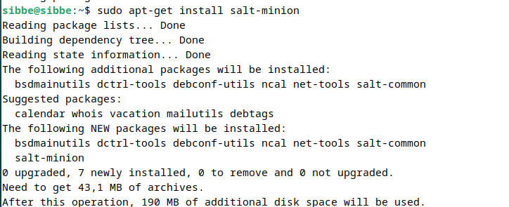

# h1 Viisikko

## X) Tiivistelmä: Verkkosivu Githubilla

1. Rekisteröidy Githubiin
2. Luo uusi säiliö, muista README.md tiedoston lisäys
3. Tallenna tehtävät .md tiedostoina
4. Lisää sisältö, oikeaoppinen rakenne
5. Tarkista ja julkaise
(Tero Karvinen. 2023. https://terokarvinen.com/2023/create-a-web-page-using-github/)


## Tiivistelmä: Salt-komennot paikallisesti

pkg.installed/removed -> ohjelman asennus/poisto   

file.managed/absent -> tiedoston tarkistaminen  

service.running/dead -> ohjelman suorituksen tarkistaminen   

user.present/absent -> käyttäjän tarkistaminen/poisto   

cmd.run -> ajetaan ohjelma, indepotentti! (vain kun tarvitaan muutoksia)   

(Tero Karvinen. 2023. https://terokarvinen.com/2021/salt-run-command-locally/)   


## a) Salt-minionin asennus koneelle



Asensin Debian 12-virtuaalikoneen ohjeiden mukaisesti.
Ennen Salt-minionin asennusta tein "Install Guest Additions for Good Resolution" jotta copypaste toimii.  
(Tero Karvinen. 2023. https://terokarvinen.com/2021/install-debian-on-virtualbox/)  
Tämän jälkeen suoritin asennusprosessin "Saltin asennus Debian 12" ohjeiden mukaisesti.  
(Tero Karvinen. 2023. https://terokarvinen.com/2023/configuration-management-2023-autumn/#h0-hello)  


## b) Viisi tärkeintä

Ohjeet tehtävään, joiden avulla tehtävä suoritettu: Tero Karvinen 2023, https://terokarvinen.com/2021/salt-run-command-locally/  
1. pkg.installed/removed, testaan installed-vaihtoehtoa.
   
Testaan onko Salt-minion asennettuna virtuaalikoneelle (:D)  
```$ sudo salt-call --local -l info state.single pkg.installed salt-minion```   

   
ID = mikä ohjelma   
Function = mikä komento   
Result = ohjelma on asennettu   
Comment = kommentti; kaikki paketit asennettu   
Started = ajankohta   
Duration = kesto (ms)   
INFO-tekstit kertovat saltin tapahtumista   
Succeeded: 1; Tapahtuma totta eli asennus löytyy.   

2. file.managed/absent

Testaan tiedoston olemassaoloa eli managed-vaihtoehtoa.   
```$ sudo salt-call --local -l info state.single file.managed /home/sibbe/olemassa```   

   

Samat käsitteet kuin aikaisemmassa kohdassa.   
WARNING ilmaisee kohdat, joita ei ole määritelty   
Tiedosto on olemassa.   

3. service.running/dead
   
Testaan Apache2:lla molemmat komentovaihtoehdot   
```$ sudo salt-call --local -l info state.single service.dead apache2 enable=False```   

   

```$ sudo salt-call --local -l info state.single service.running apache2 enable=True```   

   
Suurin piirtein yhtä kauan kesti komentojen ajo. Kommentit kertovat tilan jota tässä haettiinkin.   
Tapahtumat onnistuivat ja muuttuivat.   

4. user.present/absent

Testaan, onko oma käyttäjäni (sibbe) olemassa sekä toisen käyttäjän poiston   
```$ sudo salt-call --local -l info state.single user.present sibbe```   

   
Olen olemassa, mutta voi ei   
   
Kuka hän on   
Poistan hänet   
```$ sudo salt-call --local -l info state.single user.absent tuhoaja_uhoaja```   

   
Tapahtuma onnistunut.   

5. cmd.run

Testaan luoda tiedoston   

```$ sudo salt-call --local -l info state.single cmd.run 'touch /home/sibbe/lmao'```   

   

Kyseisellä komennolla salt tarkastaa onko tiedostoa ja luo sen jos ei ole.   
Salt ei tällä komennolla kuitenkaan tarkista tiedoston sisältöä.   


## c) Indepotenssi   

Tietotekniikassa metodi on indepotentti, jos sen vaikutukset pysyvät samana riippumatta suoritusten määrästä.   
Tässä esimerkki   
   
Komento ei asentanut palomuuria, koska se on jo olemassa eli muutoksia ei tehty. (Viisi Tärkeintä, Chris K.)   


## d) Tietoa koneesta   
Komennolla ```$ sudo salt-call --local grains.items``` tarkastelen tietoja koneestani   

   

Nämä olivat ensimmäisten tietojen joukossa. Prosessorin malli, prossun arkkitehtuuri ja tämänhetkinen työkansioni. (Tietoa_koneesta, Chris K.)


## Lähteet

Tero Karvinen. 2023. Create a Web Page Using Github. Luettavissa: https://terokarvinen.com/2023/create-a-web-page-using-github/   
Tero Karvinen. 2023. Run Salt Command Locally. Luettavissa: https://terokarvinen.com/2021/salt-run-command-locally/   
Tero Karvinen. 2023 Install Debian on Virtualbox. Luettavissa: https://terokarvinen.com/2021/install-debian-on-virtualbox/   
Tero Karvinen. 2023. Infra as Code 2023. Luettavissa: https://terokarvinen.com/2023/configuration-management-2023-autumn/   

Chris Kiuru. Viisi Tärkeintä. Luettavissa: https://github.com/bladexanarchy/pal_hal/blob/main/h1/Viisi_t%C3%A4rkeint%C3%A4.md   
Chris Kiuru. Tietoa_koneesta. Luettavissa: https://github.com/bladexanarchy/pal_hal/blob/main/h1/Tietoa_koneesta.md   

Wikipedia. 2019. Indepotenssi. Luettavissa: https://fi.wikipedia.org/wiki/Idempotenssi   

