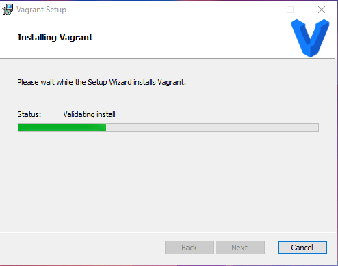
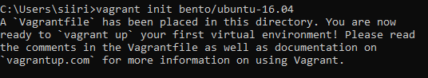
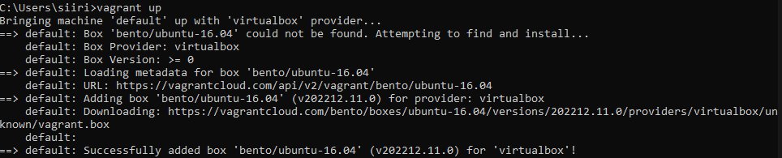
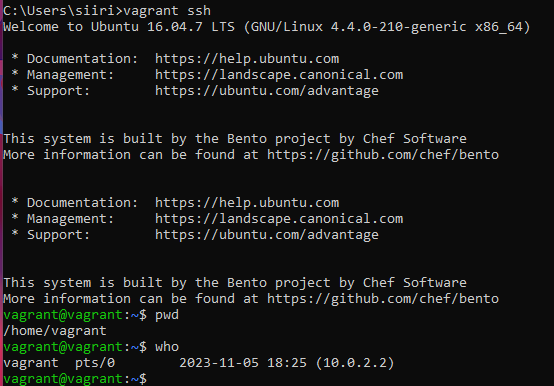

# Karjaa  

# x) Lue ja tiivistä  

## What is the definition of "cattle not pets"?  

## Vagrant  
1. Päivitys ```$ sudo apt-get update```
2. Asennus ```$ sudo apt-get install vagrant virtualbox```
3. Alusta käyttöjärjestelmä ```$ vagrant init``` komennolla
4. ```$ vagrant up``` & ssh-yhteys ```$ vagrant ssh```
5. Kun haluat lopettaa käytön -> vagrant destroy
Ohjeet Tero Karvisen materiaalista https://terokarvinen.com/2017/04/11/vagrant-revisited-install-boot-new-virtual-machine-in-31-seconds/  

## Salt Vagrant  
1. Virtualisointiympäristö
   -> VirtualBox, Vagrant & tekstieditori
2. Vagrantfile tekstieditoriin määritystä varten
3. 

# a) Vagrantin asennus  
Asennusohjeet Tero Karvisen materiaalista https://terokarvinen.com/2023/salt-vagrant/   
Isäntäkäyttöjärjestelmäni Windows 10 

Latasin Vagrantin Windows AMD64 Versio 2.4.0 tästä linkistä: https://developer.hashicorp.com/vagrant/downloads   
Käyttöehtojen hyväsymisen jälkeen asennus alkaa   

   

Tämän jälkeen ohjelma pyytää koneen uudelleenkäynnistystä.   
Sitä hyväksyessä tajusin, että ennen uudelleenkäynnistystä kannattaa tallentaa raportin muutokset   
Tajusin siis itse liian myöhään   
Vagrantin asentaminen onnistui.   

# b) Yksi maankiertäjä   
Tämän tehtävän ohjeet Tero Karvisen materiaalista https://terokarvinen.com/2017/04/11/vagrant-revisited-install-boot-new-virtual-machine-in-31-seconds/   

Ensiksi alustetaan käyttöjärjestelmä   

   
Sama versio Ubuntusta tehtävänannon kanssa, vanha on mutta ei väliä

   


   
Ssh-yhteyden muodostaminen onnistui. Kuvassa pari komentoa tilanteesta   

# Oma orjansa   
Tehtäväohjeet Tero Karvisen materiaaleista https://terokarvinen.com/2023/salt-vagrant/   


