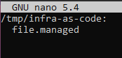

# Karjaa  

# x) Lue ja tiivistä  

## Cattle & pets  
Pet/lemmikki on useimmiten manuaalisesti hallittava ainutlaatuinen järjestelmä eli palvelin tai palvelinpari   
   -> esim. keskustietokoneet, tietokantajärjestelmät   
   
Cattle/karja on kahden tai useamman palvelimen ryhmä, joka on rakennettu automaattisilla työkaluilla ja jotka voivat kaatua   
   -> esim. verkkopalvelinryhmät   
 
Richard Slater, [What is the definition of "cattle not pets"?](https://devops.stackexchange.com/questions/653/what-is-the-definition-of-cattle-not-pets#654)   

   
## Vagrant  
1. Päivitys ```$ sudo apt-get update```
2. Asennus ```$ sudo apt-get install vagrant virtualbox```
3. Alusta käyttöjärjestelmä ```$ vagrant init``` komennolla
4. ```$ vagrant up``` & ssh-yhteys ```$ vagrant ssh```
5. Kun haluat lopettaa käytön -> ```$ vagrant destroy```      
Ohjeet Tero Karvisen materiaalista [Vagrant Revisited](https://terokarvinen.com/2017/04/11/vagrant-revisited-install-boot-new-virtual-machine-in-31-seconds/)   

## Salt Vagrant   
Tämän tehtävän materiaali Tero Karviselta [Salt Vagrant](https://terokarvinen.com/2023/salt-vagrant/)   
1. Virtualisointiympäristö   
   -> VirtualBox, Vagrant & tekstieditori   
2. Vagrantfile tekstieditoriin määritystä varten, ohjeessa yksi herra ja kaksi orjaa   
3. Vagrantin käynnistys & ```$ vagrant ssh tmaster```   
4. Masterilla hyväksytään orjien avaimet ja tarkistetaan yhteys   
5. Orjia hallitaan komennoilla   
6. Tavoitteena idempotenssi!   

# a) Vagrantin asennus  
Asennusohjeet Tero Karvisen materiaalista https://terokarvinen.com/2023/salt-vagrant/   
Isäntäkäyttöjärjestelmäni Windows 10 

Latasin Vagrantin Windows AMD64 Versio 2.4.0 tästä linkistä: https://developer.hashicorp.com/vagrant/downloads   
Käyttöehtojen hyväksymisen jälkeen asennus alkoi   

   

Tämän jälkeen ohjelma pyytää koneen uudelleenkäynnistystä.   
Sitä hyväksyessä tajusin, että ennen uudelleenkäynnistystä kannattaa tallentaa raportin muutokset   
Tajusin siis itse liian myöhään   
Vagrantin asentaminen onnistui.   

# b) Yksi maankiertäjä   
Tämän tehtävän tein Tero Karvisen materiaalia seuraten [Vagrant Revisited](https://terokarvinen.com/2017/04/11/vagrant-revisited-install-boot-new-virtual-machine-in-31-seconds/)   

Ensiksi alustetaan käyttöjärjestelmä   

   
Sama versio Ubuntusta kuin tehtävänannon kanssa, vanha on mutta ei tietääkseni väliä

   

Seuraavaksi kone käynnistettiin.

   
Ssh-yhteyden muodostaminen onnistui. Kuvassa pari komentoa tilanteesta; pwd eli tämänhetkinen työkansio ja who eli kuka kyseessä   

# c) Oma orjansa sekä D) Herra-orja arkkitehtuuri verkon yli   

Tehtäväohjeet Tero Karvisen materiaaleista https://terokarvinen.com/2023/salt-vagrant/   

Ensimmäiseksi copypastesin ohjesivun valmiiksi kirjoitetun Vagrantfilen olemassa olevan tiedoston päälle   
Tämän tein resurssienhallinnassa, josta ei kuvaa.   
Vagrantfilessa siis lukee, kuinka monta ja millaisia virtuaalikoneita halutaan luoda.   
Tämän jälkeen ```$ vagrant up``` ja odotetaan pieni hetki   

   
(Todella pitkä lista masterin ja orjien määrityksistä)

   

Tämän jälkeen otin ssh-yhteyden masteriin, hyväksyin orjien jo valmiiksi lähettämät avaimet ja testasin yhteyden ping-komennolla   

   

Molemmat koneet vastaavat true, herra, orjat ja niiden välinen yhteys on luotu.   
Tämän tehtävän teossa auttoi Chris Kiuru   

# Loput tehtävät verkossa   

Esimerkkikomennot otin Tero Karvisen materiaalista https://terokarvinen.com/2023/salt-vagrant/   

## Idempotentteja komentoja      

Ensin asennan apache2 orjiin   
```$ sudo salt '*' state.single pkg.installed apache2```   

   

   
Kuvassa näkyy t002 koneen asennustapahtuman tiedot ja t001 koneen yhteenveto   
Changed=1 molemmille koneille eli asennus tapahtui.   
Ajoin saman komennon uudelleen todistaakseni idempotenssin;   

   

Sama ilmoitus tuli myös t002 koneelle.   
"All specified packages are already installed"   

Tämän jälkeen testasin onko samainen ohjelma päällä   
```$ sudo salt '*' state.single service.running apache2```   

   

"The service apache2 is already running"   

## Tietojen keräystä orjista   

```$ sudo salt '*' grains.item osfinger cpu_model```   

   

Intel i5-12600KF prosessori

```$ sudo salt '*' grains.item osfinger mem_total```   

   

Muistin määrä.   

## Shell-komento   

```$ sudo salt '*' cmd.run 'ls -lah'```   

Shell-komento, tuttu ```$ ls -la``` listaus

   

## Hello, IaC   

Tein tämän tehtävän Tero Karvisen esimerkin mukaan (https://terokarvinen.com/2023/salt-vagrant/)   

Ensin loin Salt State Filelle kansion hello komennolla ```$ sudo mkdir -p /srv/salt/hello```   
Tämän jälkeen SLS-tiedoston luominen komennolla ```$ sudoedit /srv/salt/hello/init.sls```   
(Chris K. [h2](https://github.com/bladexanarchy/pal_hal/blob/main/h2/h2.md))   

   

   

Ja tämän jälkeen testasin, onko pyytämäni muutos oikeasti tehty:
Siirryin tätä varten t001 koneeseen   

   

Tiedosto löytyi.   

# Lähteet   

Tero Karvinen. 2017. Vagrant Revisited - Install & Boot New Virtual Machine in 31 seconds. Luettavissa: https://terokarvinen.com/2017/04/11/vagrant-revisited-install-boot-new-virtual-machine-in-31-seconds/ Luettu: 5.11.2023.   

Tero Karvinen. 2023. Salt Vagrant - automatically provision one master and two slaves. Luettavissa: https://terokarvinen.com/2023/salt-vagrant/ Luettu: 5.11.2023   

Tero Karvinen. 2023. Infra as Code 2023. Luettavissa: https://terokarvinen.com/2023/configuration-management-2023-autumn/ Luettu: 5.11.2023   

Vagrant N.d. Install Vagrant. https://developer.hashicorp.com/vagrant/downloads   

Chris Kiuru. h2. Luettavissa: https://github.com/bladexanarchy/pal_hal/blob/main/h2/h2.md   

Richard Slater. 2017. What is the definition of "cattle not pets"?. Luettavissa: https://devops.stackexchange.com/questions/653/what-is-the-definition-of-cattle-not-pets#654 Luettu: 5.11.2023   


