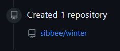

# h3. Versio  

## a) Online  

Tässä tehtävässä tein uuden varaston [Tero Karvisen ohjeiden](https://terokarvinen.com/2023/create-a-web-page-using-github/) mukaisesti ja siten tämä kohta on valmis.  

  

## b) Dolly  

Kopioin seuraavaksi vasta luodun varaston SSH-linkin  

  
Uusi kansio myös tähän väliin  

  
Seuraavaksi asensin Gitin  

  

Loin ssh-keygenilla avaimen ja luin "id_rsa.pub" (.pub -tiedosto on siis luotujen avainparin julkinen avain) ja kopioin tämän  

  

Kopioitu julkinen avain githubiin asetuksissa    

  

Tässä kloonataan aikaisemmin luodun varaston SSH-linkki h3-kansioon.  
Kloonaus näyttänee onnistuneen.  

  

  
Loin tiedoston jossa on tekstiä  

  
Oma käyttäjä  

  

```$ git add``` -komennolla lisätään tiedosto versionhallintaan ja tarkistetaan gitin status komennolla ```$ git status```  

  
Tein ensimmäisen commitin komennolla ```$ git commit -m "eka commit"```  

  

Sekä push, jonka jälkeen tiedosto ilmestyi varastooni  

  

Tarkistus selaimessa  

## c) Doh!  

Poistin gitin kautta testi.txt tiedoston  

  

Ja peruin tämän huonon muutoksen komennolla ```$ git reset --hard```  

  
Kyseinen komento siis palauttaa tiedostot takaisin tilaan, joka on viimeksi commitattu.  

## d) Tukki

Apuna tässä tehtävässä Chris Kiuru  

  

Nimi ja sposti näkyy. Lisäksi paikka ja aika sekä kommentti.  
Head = tämänhetkinen commit  
main = branchin oletusnimi  
origin = viittaa etä repoon  

(StackOverflow, https://stackoverflow.com/questions/75202925/meaning-of-head-main-vs-origin-head)  

## Lähteet  

Tero Karvinen 2023. Infra as Code 2023. Luettavissa: https://terokarvinen.com/2023/configuration-management-2023-autumn/  
StackOverflow 2023. Meaning of HEAD -> main vs origin/HEAD. Luettavissa: https://stackoverflow.com/questions/75202925/meaning-of-head-main-vs-origin-head  
Chris Kiuru 2023. h3. Luettavissa: https://github.com/bladexanarchy/pal_hal/blob/main/h3/h3.md  


