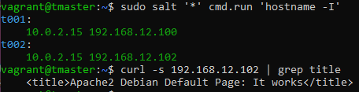

# h4 Demonit  
## x) Lue ja tiivistä  
### Salt Vagrant  
  [Salt Vagrant](https://terokarvinen.com/2023/salt-vagrant/#infra-as-code---your-wishes-as-a-text-file)   
  Salt state / tilatiedoston ja sen kansion luominen;  
  - ```$ sudo mkdir -p /srv/salt/lol```, jossa -p luo hakemistot niiden puuttuessa  
  - ```$ sudoedit /srv/salt/lol/muuttuja.sls```  
  - YAML: ei tabeja!  
  - _File.managed_ lataa tiedostot salt masterista ja asettaa kohdejärjestelmään
  - top.sls; top tiedosto määrittää, mitä tiloja ajetaan milläkin koneella  
 
    https://www.geeksforgeeks.org/mkdir-command-in-linux-with-examples/  
    https://docs.saltproject.io/en/latest/ref/states/all/salt.states.file.html  

### Salt overview   
  [Salt user guide](https://docs.saltproject.io/salt/user-guide/en/latest/topics/overview.html#rules-of-yaml)
  
  - Rules of YAML:  
  YAML (Yet Another Markup Language, nykyään YAML Ain't Markup Language) on pääasiassa konffaukseen käytetty ohjelmointikieli;  
  
  Data rakentuu _avain: arvo_ pareihin
    -> Merkitään kaksoispisteellä ja välilyönnillä  
  Kirjainkoolla on väliä, tabia ei saa käyttää  
  Kommentti alkaa merkillä #  
  
  - YAML simple structure:

1. Skalaarit eli _avain: arvo_ parit
2. Lista = avain jonka alle sisentyy arvoluettelo
3. Kirjasto = kokoelma skalaareista ja listoista
   

    - Lists and dictionaries - YAML block structures:  

    YAML on järjestetty lohkorakenteiksi  
    Sisennys määrittää kontekstin eli ominaisuuksien ja listojen sisennys ehdotonta; vakio on kaksi välilyöntiä  
   Kokoelman jokainen merkintä osoitetaan viivalla -.

### Salt states  
  [Salt states](https://docs.saltproject.io/salt/user-guide/en/latest/topics/states.html#state-modules)

  - State modules:

  Tilaa luotaessa tilamoduuli _module.function_ määrittää, mitä toimintoja koneella halutaan suorittaa  
  Tila- ja suoritusmoduulien välille voi syntyä ristiriitoja (!)  
  
  - The state SLS data structure:  

  Tilatiedostossa on määritelty seuraavat kohdat:  
  Tunniste, tila, funktio, nimi ja argumentit  

  - Organizing states:
 
  Tilatiedostot tulisi kirjoittaa toiselle kehittäjälle helposti ymmärrettävällä tavalla  
  Hyvä käytäntö on käyttää sisennyksiä maltillisesti  

  - The top.sls file:
  
  Satojen tilojen ja tuhansien koneiden ympäristössä on epäkäytännöllistä ajaa lukuisia yksittäisiä tiloja  
    -> top.sls tiedosto
  

  - Create the SSH state, Create the Apache state:


  ## a) Hello SLS! sekä b) Top  

  Aloitin käynnistämällä koneen ```$ vagrant up```  
  Jonka jälkeen ssh-yhteys masteriin ```$ vagrant ssh tmaster```  
  Josta orjien avainten hyväksyminen ```$ sudo salt-key -A```  
  Ja yhteyden testaaminen ```$ sudo salt '*' test.ping``` (onnistui)  

  Tämän jälkeen loin [Tero Karvisen ohjeiden](https://terokarvinen.com/2023/salt-vagrant/) mukaisesti init.sls tiedoston  
  
  -> ```$ sudo mkdir -p /srv/salt/hello``` loi hello-kansion ja muut puuttuvat -p optionilla  
    
  Kuvasta näkyykin haluttu tilanne eli tiedostojen luominen tapahtunut.  

    

  Exit masterista ja siirryin minionille t001 tarkastamaan, että tiedosto varmasti löytyy.  

    

  Sieltä löytyi. Takaisin masterille ja ajoin komennon ```$ sudo salt '*' state.apply``` uudelleen  

    

  Kuvasta voi lukea, että komennon ajon jälkeen muutoksia ei tapahtunut.  

  ## c) Apache  

  Ensimmäiseksi Apachen asennus [Tero Karvisen ohjeita](https://terokarvinen.com/2023/salt-vagrant/) katsoen erityisesti komentojen takia    
  
  Komento olikin ```sudo salt 't002' state.single pkg.installed apache2```, asensin siis toiselle orjalle Apachen.  

    

  Tässä välissä listaus monista muutoksista  

    

  _Succeeded: 1_ eli onnistunut komennon ajo ja _changed=1_ eli muuttunut tila: Apachen asennus.  

  Tässä vaiheessa testasin vielä ```$ sudo salt 't002' state.single service.running apache2```  
    ... ja vastaukseksi sain "The service apache2 is already running"  

  Ohjeissa testataan vielä että demoni _oikeasti_ on käynnissä käyttämällä curl-komentoa;  
  (Tässä vaiheessa asensin curlin ```$ sudo apt-get -y install curl```)  
  Jonka jälkeen ip-osoiteselvitys ja curl  

    

  It works :-)  Siispä poistan Apachen vielä käsin  
  ```$ sudo salt 't002' state.single pkg.removed apache2```  

    

  "All targeted packages were removed" eli poisto onnistui; Succeeded: 1  

  Seuraavaksi automatisointiyritys. 

  Loin ensiksi uuden kansion ```$ sudo mkdir -p /srv/salt/apache```  
  Ja apache-kansioon uusi tilatiedosto, johon kirjoitin seuraavasti:  
  ([Salt user guide](https://docs.saltproject.io/salt/user-guide/en/latest/topics/states.html#state-modules))  

    

    

  Eli  
  Apache2: pkg.installed (avain: arvo pari); viittaa apachen asennusta kohteeseen  
  /var/www/html/index.html: file.managed määrittää kyseisessä polussa olevan HTML tiedoston tilan hallinnan  
  Name määrittää HTML tiedoston tavoitesijainnin minionissa  
  Source eli lähde; tässä tapauksessa tiedosto testi.html hakemistosta apache2 mainittuun kohteeseen  

  Kuvissa tekstit ovat korjauksien jälkeiset. Tässä pari mokaa lol  
  
  - Aluksi vahingossa pkg.installed:  
    

  - Ja vielä alkuperäisen apache-kansion nimeksi apache2  
    

  Korjasin siis nuo ja komennolla ```$ sudo salt '*' state.apply apache2``` näytti seuraavaa:  

    

    

  "The following packages were installed/updated: apache2" eli Apachen asennus onnistui.  

  ## SSHouto  

  
  

  


  

  


  

  

  
  


  
  
  

  

  
  

  

  

  

  
  
  
  

  

  
    
  
  

  

  

  
  
  
   
  

  
  
  
